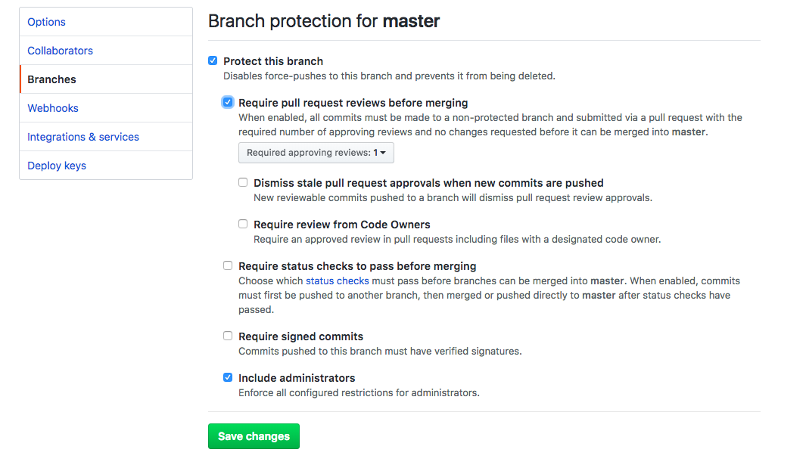
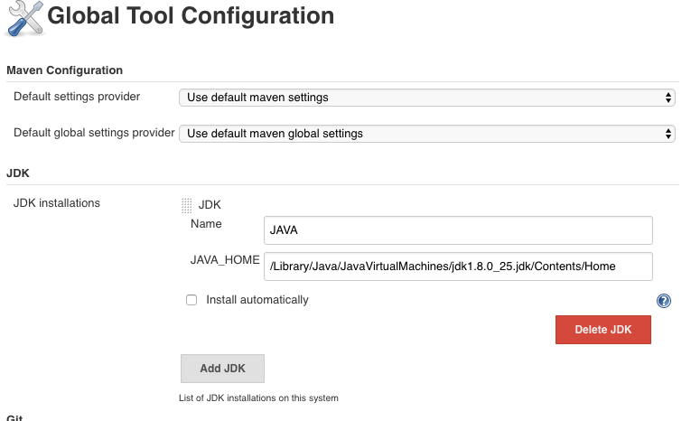
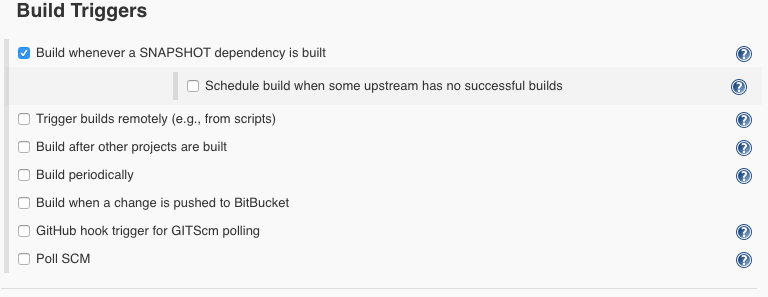

# CI/CD With Git Jenkins Artifactory And ELK Stack

## Installation and Configuration

### Install and Configuration Apache Tomcat

* Download [Tomcat](http://mirrors.viethosting.com/apache/tomcat/tomcat-8/v8.5.29/bin/apache-tomcat-8.5.29.tar.gz)

```
$ mkdir DevOps
$ cd DevOps/apache-tomcat-8.5.29/
$ cd conf
$ vi tomcat-users.xml
```

```
<role rolename="tomcat"/>
<role rolename="manager-gui"/>
<role rolename="manager-script"/>
<user username="tomcat" password="Aviva@Tomcat" roles="tomcat"/>
<user username="manager" password="Aviva@Manager" roles="tomcat,manager-gui"/>
<user username="jenkins" password="Aviva@Jenkins" roles="manager-script"/>
```
```
$ cd ..
$ cd bin
$ chmod +x *.sh
$ ls -l 
$ ./catalina.sh start
$ tail ../logs/catalina.out
```
* http://localhost:8080/

### Install and Configuration Jfrog Artifactory
* Download [Jfrog Artifactory](https://api.bintray.com/content/jfrog/artifactory/jfrog-artifactory-oss-$latest.zip;bt_package=jfrog-artifactory-oss-zip)

```
$ cd DevOps/artifactory-oss-5.9.1/bin
$ ./artifactory.sh
```

* Skip Set Admin Password
* Skip Configure a Proxy Server
* Create Repositories: Chose maven


* Note: Configure a Proxy Server

* http://localhost:8040/

### Install and Configuration Maven
* Download [Maven](http://mirrors.viethosting.com/apache/maven/maven-3/3.5.3/binaries/apache-maven-3.5.3-bin.zip)

```
$ cd
$ ls -all
$ vi .bash_profile
```

```
# java setting
export JAVA_HOME=/Library/Java/JavaVirtualMachines/jdk1.8.0_25.jdk/Contents/Home
export PATH=$PATH:$JAVA_HOME/bin

#maven setting
export M2_HOME=/Users/apple/DevOps/apache-maven-3.5.3
export M2=$M2_HOME/bin
export PATH=$PATH:$M2
```

```
$ more .bash_profile
$ source ~/.bash_profile
```
### Install and Configuration Jenkins

* get password admin
```
$ sudo more /Users/Shared/Jenkins/Home/secrets/initialAdminPassword
$ cd /Users/Shared/Jenkins/Home
$ sudo vi hudson.model.UpdateCenter.xml
```

```
<url>http://updates.jenkins.io/update-center.json</url>
```

```
Username:	admin  
Password:	Aviva@Jenkins
Confirm password:	Aviva@Jenkins
Full name:	JenkinsAdmin
E-mail address:thanhlam297@gmail.com
```
```
$ defaults read /Library/Preferences/org.jenkins-ci
$ sudo defaults write /Library/Preferences/org.jenkins-ci httpPort 8090
$ sudo launchctl unload /Library/LaunchDaemons/org.jenkins-ci.plist
$ sudo launchctl load /Library/LaunchDaemons/org.jenkins-ci.plist
```
* http://localhost:8090/
https://wiki.jenkins.io/display/JENKINS/Thanks+for+using+OSX+Installer

### Maven security setting

```
$ cd
$ cd .m2
$ cp settings-security.xmlbk settings-security.xml
$ cp settings.xmlbk settings.xml
$ mvn -emp password
```
`{Aorr/QuO7NIH7KAAUEcS3+/wLYyEXEduDHXIJDl8XXs=}`

```
$ vi settings-security.xml
```

```
$ mvn -ep password
```
`{j+TStP2167QH0VtfkE8KPvMXN3tv4s5tRJwXlUN9/Ak=}`

```
$ vi settings.xml
```

```
<?xml version="1.0" encoding="UTF-8"?>
<settings>
  <profiles>
    <profile>
      <id>default</id>
      <repositories>
        <repository>
          <id>release</id>
          <name>release</name>
          <url>http://localhost:8040/artifactory/libs-release-local</url>
          <releases>
            <enabled>true</enabled>
          </releases>
          <snapshots>
            <enabled>false</enabled>
          </snapshots>
        </repository>
        <repository>
          <id>snapshot</id>
          <name>snapshot</name>
          <url>http://localhost:8040/artifactory/libs-snapshot-local</url>
          <releases>
            <enabled>false</enabled>
          </releases>
          <snapshots>
            <enabled>true</enabled>
            <updatePolicy>always</updatePolicy>
          </snapshots>
        </repository>
      </repositories>
    </profile>
  </profiles>
  <activeProfiles>
    <activeProfile>default</activeProfile>
  </activeProfiles>
  <servers>
    <server>
      <id>release</id>
      <username>admin</username>
      <password>{j+TStP2167QH0VtfkE8KPvMXN3tv4s5tRJwXlUN9/Ak=}</password>
    </server>
    <server>
      <id>snapshot</id>
      <username>admin</username>
      <password>{j+TStP2167QH0VtfkE8KPvMXN3tv4s5tRJwXlUN9/Ak=}</password>
    </server>
  </servers>
</settings>

```
* Adding a new SSH key to your GitHub account
```
$ ssh-keygen -t rsa -b 4096 -C "thanhlam297@gmail.com"
$ eval "$(ssh-agent -s)"
$ ssh-add -K ~/.ssh/id_rsa
$ pbcopy < ~/.ssh/id_rsa.pub
```


```
vi .bash_profile
```

```
#git branch in prompt.
parse_git_branch() {
    git branch 2> /dev/null | sed -e '/^[^*]/d' -e 's/* \(.*\)/ (\1)/'
}

#prompt settings
export PS1="\u@\h \w\[\033[34m\]\$(parse_git_branch)\[\033[00m\]$"
```

```
$ source .bash_profile
```

### Setup github

* create develop branch and set it is a default branch
* set master branch is protection
* create branch for feature


### Configure for SCM and Artifactory

* Add to pom.xml

```xml
<distributionManagement>
  <repository>
    <id>release</id>
    <name>releases</name>
    <url>http://localhost:8040/artifactory/libs-release-local</url>
  </repository>
  <snapshotRepository>
    <id>snapshot</id>
    <name>snapshots</name>
    <url>http://localhost:8040/artifactory/libs-snapshot-local</url>
  </snapshotRepository>
</distributionManagement>

<scm>
  <connection>scm:git:git@github.com:lamnguyen297/devops.git</connection>
  <developerConnection>scm:git:git@github.com:lamnguyen297/devops.git</developerConnection>
  <url>git@github.com:lamnguyen297/devops.git</url>
  <tag>HEAD</tag>
</scm>

<plugin>
  <groupId>org.apache.maven.plugins</groupId>
  <artifactId>maven-release-plugin</artifactId>
  <version>2.5.1</version>
  <configuration>
    <tagNameFormat>v@{project.version}</tagNameFormat>
    <autoVersionSubmodules>true</autoVersionSubmodules>
  </configuration>
</plugin>

```

```
$ mvn clean package deploy
```


### Configure for Jenkins
* new password: Aviva@Jenkins
```
$ sudo passwd jenkins
$ whoami
$ cd
$ ls -l
$ ssh-keygen -t rsa -b 4096 -C "thanhlam297@gmail.com"
$ eval "$(ssh-agent -s)"
$ ssh-add -K ~/.ssh/id_rsa
$ cd .ssh
$ more id_rsa.pub
```

* Copy key to github

```
$ cd
$ mkdir .m2
$ cp /Users/apple/.m2/*.xml .m2/
```

```
$ sudo su jenkins
$ cd
$ ssh -T git@github.com
$ git config --global user.name "jenkins"
$ git config --global user.email thanhlam297@gmail.com
```










* `Username Variable	`: tcuser, `Password Variable`: tcuser
* `Username Variable	`: tcpass, `Password Variable`: tcpass

```
curl -u ${tcuser}:${tcpass} -T target/**.war "http://localhost:8080/manager/text/deploy?path=/devops&update=true"
```

```
$ git checkout develop
$ git pull origin develop
```

* create release branch
* push code to all branch


```
$ git checkout develop
```

```xml
<artifactId>devops</artifactId>
	<version>1.1.0-SNAPSHOT</version>
	<packaging>war</packaging>
```

```
$git commit -am "Preparing for next release"
$git push origin develop
```

### QA Config

```
$ mkdir DevOpsQA
$ cp -R /Users/apple/Workspace/50-Devops/10-Downloads/apache-tomcat-8.5.29 DevOpsQA/
```

```
curl -u ${tcuser}:${tcpass} -T target/**.war "http://localhost:9080/manager/text/deploy?path=/devops&update=true"
```

### PROD Config

```
$ mkdir DevOpsProd
$ cp -R /Users/apple/Workspace/50-Devops/10-Downloads/apache-tomcat-8.5.29 DevOpsProd/
```

```
echo "Deploying war from http://localhost:8081/artifactory/libs-release-local/com/example/devops/${tag:1}/devops-${tag:1}.war"

curl -O http://localhost:8081/artifactory/libs-release-local/com/example/devops/${tag:1}/devops-${tag:1}.war
```

```
export JAVA_OPTS="$JAVA_OPTS -Dspring.profiles.active=dev"
```

### Monitoring

```
$ cp -R /Users/apple/Workspace/50-Devops/10-Downloads/elasticsearch-6.2.3 DevOps/
$ cp -R /Users/apple/Workspace/50-Devops/10-Downloads/kibana-6.2.3-darwin-x86_64 DevOps/
cp -R /Users/apple/Workspace/50-Devops/10-Downloads/logstash-6.2.3 DevOps/
```

```
$ cd DevOps/elasticsearch-6.2.3/config
$ vi elasticsearch.yml
$ cd /DevOps/elasticsearch-6.2.3/bin
$ ./elasticsearch
```

* http://localhost:9200/

```
$ cd DevOps/kibana-6.2.3-darwin-x86_64/config
$ vi kibana.yml
```

```
elasticsearch.url: "http://localhost:9200"
```

```
$ cd ../bin
$ ./kibana
```

* http://localhost:5601/app/kibana

* logstash-pipeline.conf

```json
input {
  file {
    type => "tomcat"
    path => "/Users/apple/DevOps/apache-tomcat-8.5.29/logs/devops.log"
    start_position => "beginning"
    add_field => {
      "server"  =>  "dev"
      "app"     =>  "devops"
    }
  }
  file {
    type => "tomcat"
    path => "/Users/apple/DevOpsQA/apache-tomcat-8.5.29/logs/devops.log"
    start_position => "beginning"
    add_field => {
      "server"  =>  "qa"
      "app"     =>  "devops"
    }
  }
  file {
    type => "tomcat"
    path => "/Users/apple/DevOpsProd/apache-tomcat-8.5.29/logs"
    start_position => "beginning"
    add_field => {
      "server"  =>  "prod"
      "app"     =>  "devops"
    }
  }
  stdin { }
}

filter {
  if [type] == "apache" {
    grok {
      match => { "message" => "%{COMBINEDAPACHELOG}" }
    }
    date {
      match => [ "timestamp" , "dd/MMM/yyyy:HH:mm:ss Z" ]
    }
  }
  if [type] == "tomcat" {
    grok {
      match => [ "message", "%{TOMCATLOG}", "message", "%{CATALINALOG}" ]
    }
    date {
      match => [ "timestamp", "yyyy-MM-dd HH:mm:ss,SSS Z", "MMM dd, yyyy HH:mm:ss a" ]
    }
  }

}

output {
  elasticsearch {
    hosts => ["localhost:9200"]
  }
  stdout {
    codec => rubydebug
  }

}

```

```
$ cd DevOps/logstash-6.2.3/
$ bin/logstash -f logstash-pipeline.conf
```

* Download [SonnarQube](https://sonarsource.bintray.com/Distribution/sonarqube/sonarqube-6.7.2.zip)

```
$ cd DevOps/sonarqube-6.7.2/bin/macosx-universal-64/bin
$ ./sonar.sh console
```

```
$ http://localhost:9000/
```


```
$ cd .m2/
$ vi settings.xml
```

* add code below

```xml
  <profile>
      <id>sonar</id>
      <activation>
          <activeByDefault>false</activeByDefault>
      </activation>
      <properties>
          <sonar.host.url>http://localhost:9000</sonar.host.url>
          <sonar.login></sonar.login>
      </properties>
  </profile>
```

* add token `57e1e40e036ee65090f943a97ed8867ced0a0a61`

```xml
  <profile>
      <id>sonar</id>
      <activation>
          <activeByDefault>false</activeByDefault>
      </activation>
      <properties>
          <sonar.host.url>http://localhost:9000</sonar.host.url>
          <sonar.login>57e1e40e036ee65090f943a97ed8867ced0a0a61</sonar.login>
      </properties>
  </profile>
```

* Add Properties for to pom.xml

```xml
<surefire.version>2.17</surefire.version>
<jacoco.version>0.7.9</jacoco.version>
```

* Add Plugin for to pom.xml

```xml
<plugin>
  <groupId>org.apache.maven.plugins</groupId>
  <artifactId>maven-surefire-plugin</artifactId>
  <version>${surefire.version}</version>
</plugin>
<plugin>
    <groupId>org.jacoco</groupId>
    <artifactId>jacoco-maven-plugin</artifactId>
    <version>${jacoco.version}</version>
    <executions>
        <execution>
            <id>default-prepare-agent</id>
            <goals><goal>prepare-agent</goal></goals>
        </execution>
        <execution>
            <id>default-report</id>
            <phase>prepare-package</phase>
            <goals><goal>report</goal></goals>
        </execution>
    </executions>
</plugin>
```

```
$ mvn sonar:sonar
```